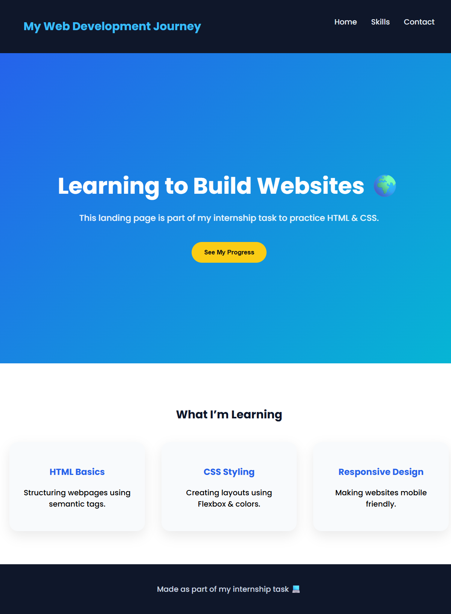

# 🌐 Student Web Dev Journey – Responsive Landing Page

## 📌 Project Overview
This project is a responsive landing page built using HTML and CSS as part of my web development internship task.

The aim of this project is to understand how a modern webpage is structured, styled and made responsive across different devices.

This landing page represents the starting point of my journey in web development.

---

## 🎯 Objective
The main goal of this task was to design a clean and simple landing page that includes:

- Navigation Header  
- Hero Section with Call-to-Action button  
- Skills / Features Section  
- Footer Section  
- Responsive design for mobile and desktop screens  

---

## 🧩 Development Process

### 🏗️ Page Structure
The webpage was created using semantic HTML elements to organize content into clear sections such as navigation, hero, features and footer.

### 🎨 Styling & Layout
CSS was used to enhance the visual design:

- Flexbox used for layout and alignment  
- Modern color palette for better contrast  
- Hover effects and smooth scrolling added  
- Sticky navigation bar implemented  

### 📱 Responsive Design
Media queries were applied to make the webpage adaptable across devices:

- Desktop layout with horizontal navigation  
- Mobile layout with stacked sections  
- Flexible feature cards that adjust based on screen width  

---

## 💻 Technologies Used
- HTML5  
- CSS3  
- Flexbox  
- Media Queries  

---

## 📈 Key Learnings
Through this project, I learned how to:

- Build a webpage from scratch  
- Apply CSS styling and layouts  
- Create responsive designs  
- Understand basic UI design principles  

---

## 📷 Preview

---

## 👩‍💻 Author
**Pradakshina S**  
Web Development Intern
